# Project 3

## F3 CrowdFunding For Real Estate 

Compile and Deployment of Smart Contract demo1.sol

* Compile

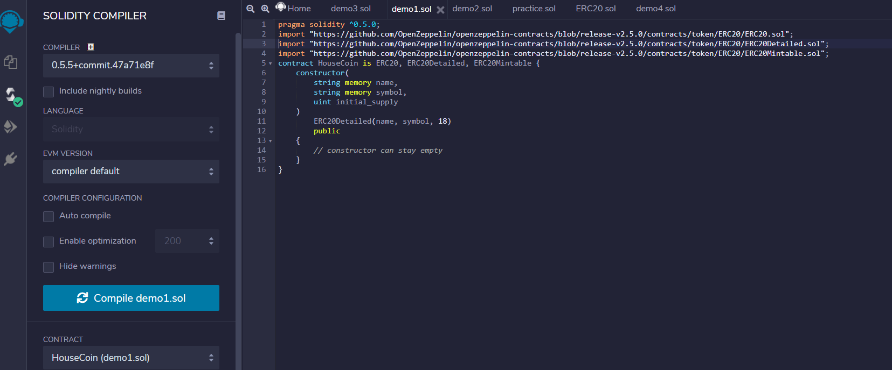

* Deploy HouseCoin/browser/demo1.sol
* Fill in name, symbol, Intial_supply

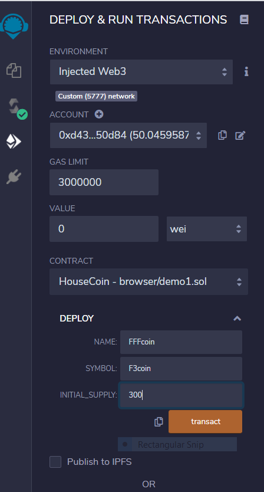

* confirm

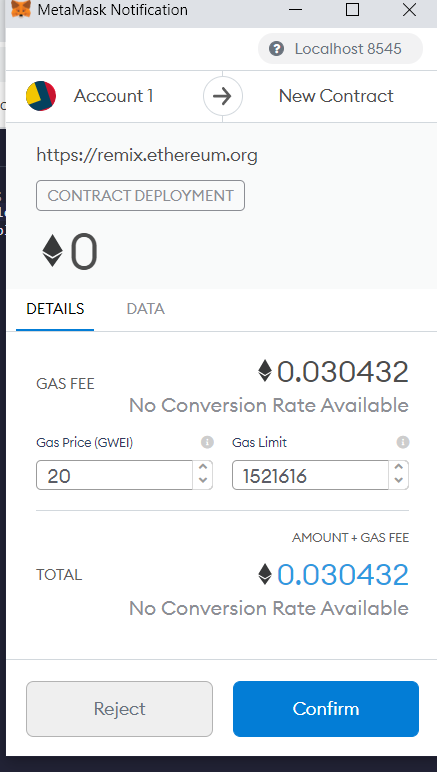

* menu bar should show up when contract tab expanded
* Can now run transactions

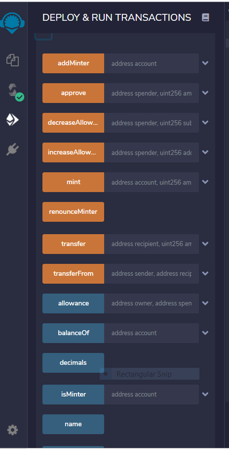

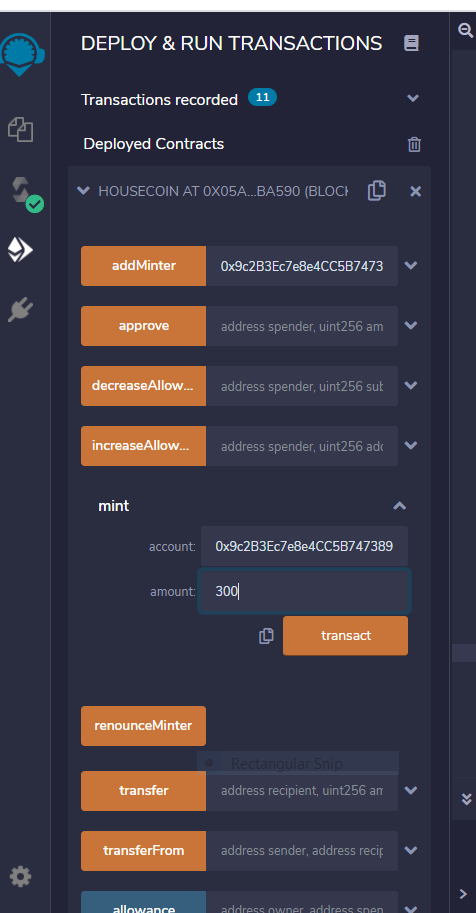

* compile contract demo2.sol

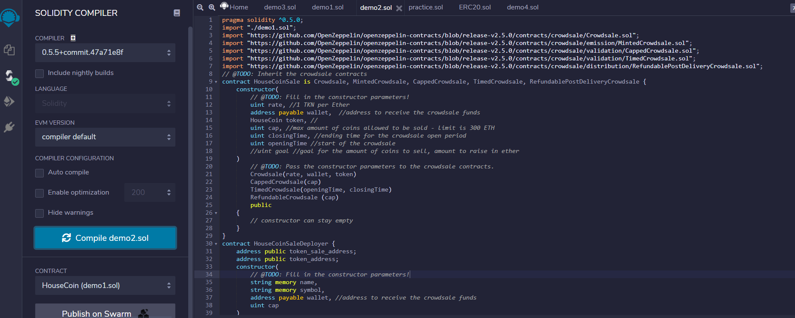

* Deploy HouseCoinSaleDeployer with required information

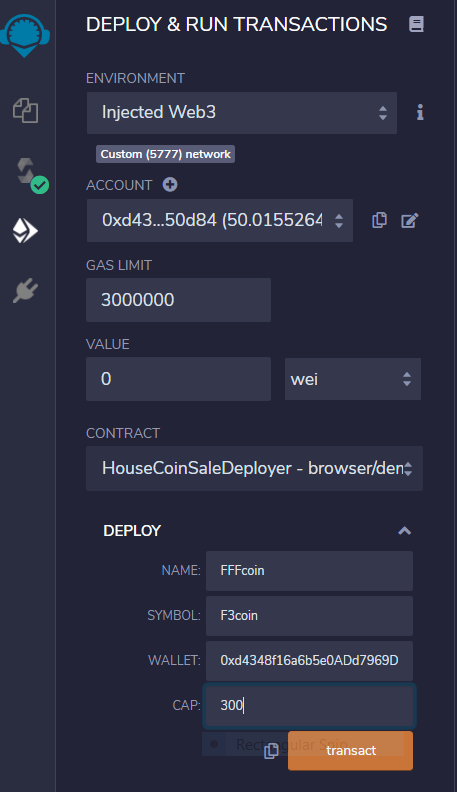

* Confirm

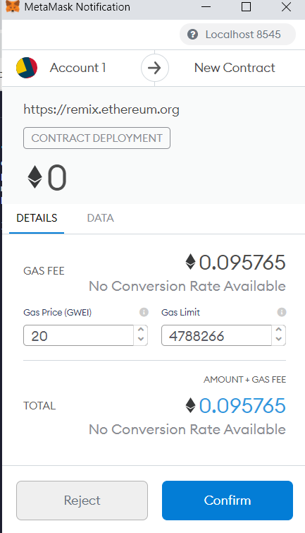

* Addresses to use for deployment of the rest ot the contract

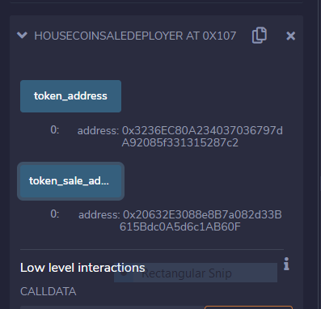

* Use token_address to deploy HouseCoinSale with the At Address button

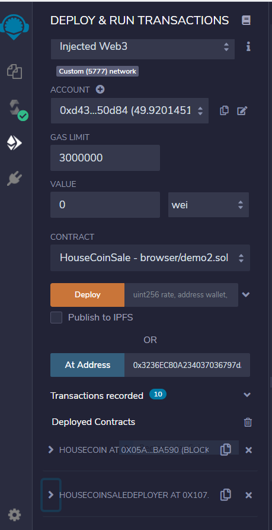

* Can now run transactions

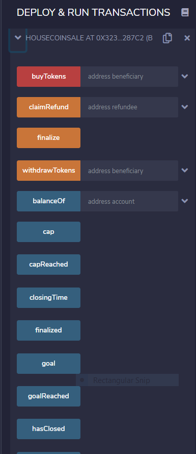

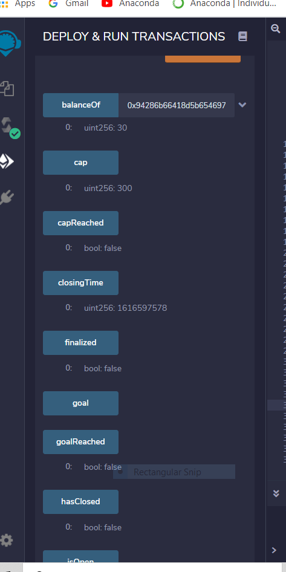

* Compile demo3.sol

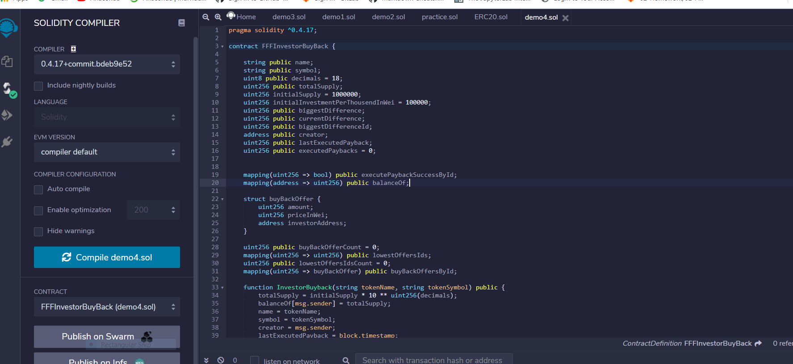

* Confirm

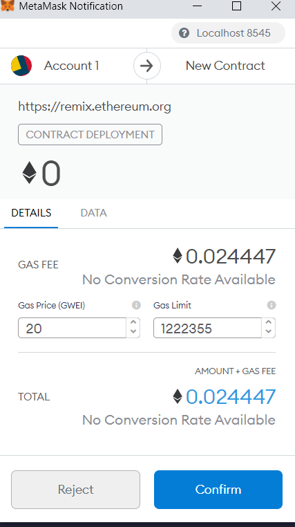

* Deploy with required information

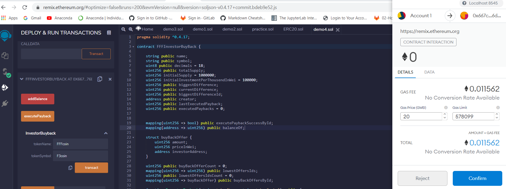

* Confirm

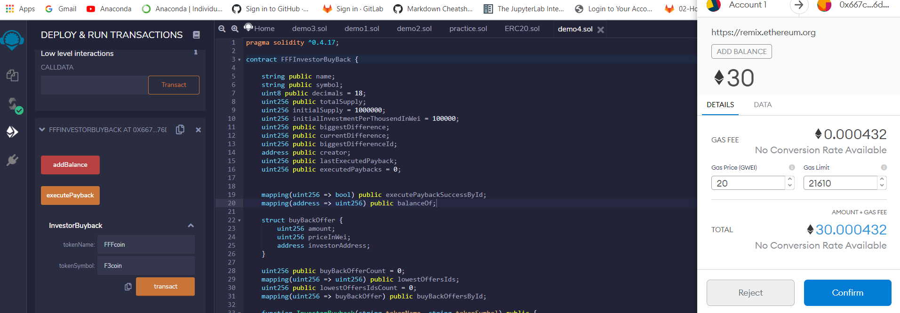

* Ready for Buy Back

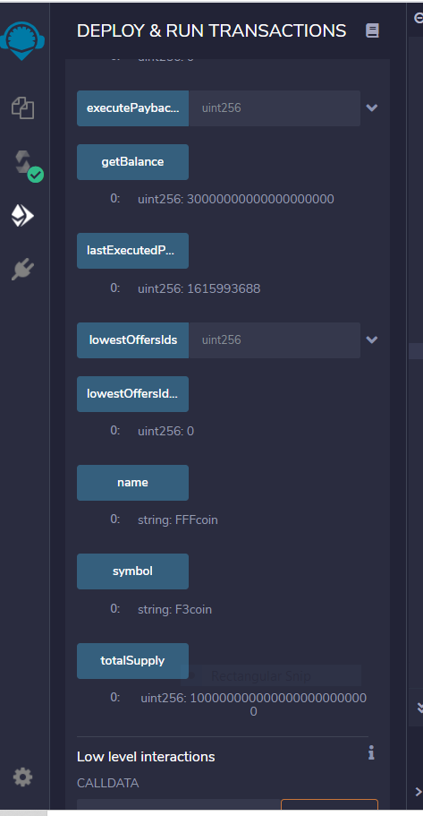
